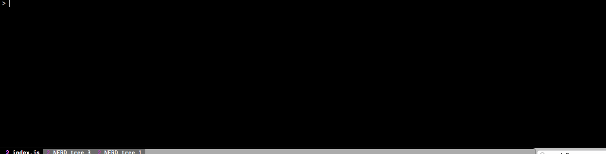

mage-console
============

Alternative MAGE development console, with REPL interface.



Features
--------

  - REPL interface which lets you introspect your MAGE application
  - Watches your './lib' folder and automatically reloads the worker on file changes

Requirements
------------

### MAGE Version

This module is compatible with MAGE >= 1.0.0. Note that if
you have upgraded an older MAGE application to MAGE 1.0.0, you
will need to make sure that your `./lib/index.js` follows
the new initialisation pattern.

### Application configuration

`mage-console` will only work when your application is configured
in cluster mode to start a single process:

```yaml
### Make sure `config/development.yml is configured as such
server:
  cluster: 1
```

Installation
------------

In your MAGE project:

```shell
npm install --save mage-console
```

Then, in your project's `package.json`, update the develop script job
from `npm run mage` to `mage-console`:

```json
{
    "scripts": {
        "develop": "mage-console"
    }
}
```

Then simply run `npm run develop` like you would normally do.

License
--------

MIT.
